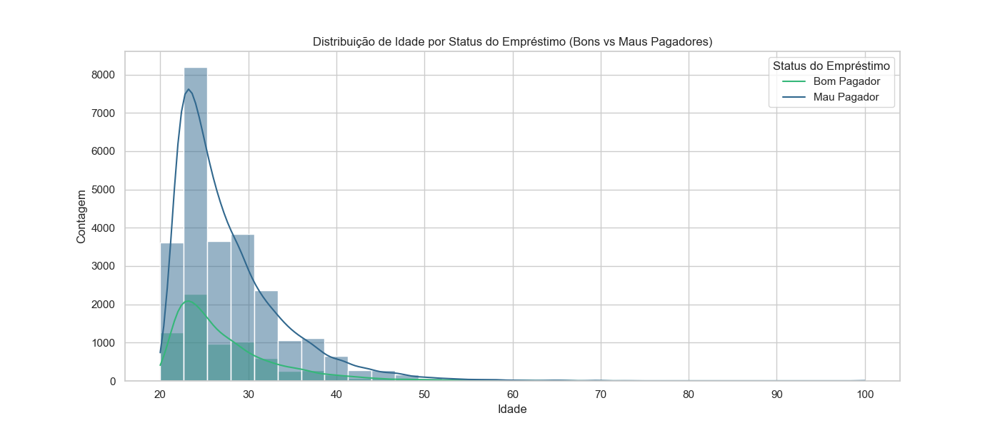
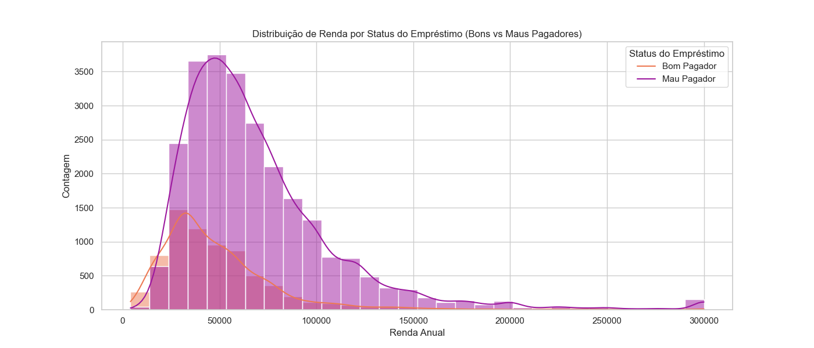
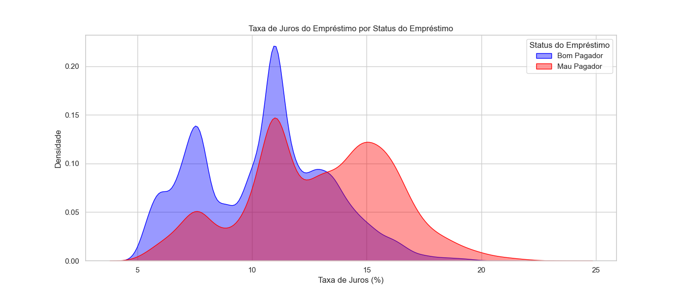

# Credit Risk Analysis

## Project Description

This project aims to analyze a dataset related to credit risk, utilizing data science techniques and machine learning to predict the likelihood of clients defaulting on loans. The analysis seeks to provide valuable insights for financial institutions, aiding in informed decision-making regarding credit granting.

## Importance of the Work

Understanding credit risk is crucial for financial institutions as it directly impacts their profitability and stability. Accurate predictions of loan defaults can help banks and lenders manage their risks more effectively, leading to healthier loan portfolios. By identifying patterns and factors associated with defaults, this project can contribute to more robust credit evaluation processes, ensuring that loans are extended to clients who are likely to repay. Furthermore, these insights can enhance customer relationships and drive strategic initiatives in credit management.

## Dataset

The dataset used in this project was obtained from a file named `credit_risk_dataset.csv`. This dataset contains information about loan applicants, including demographic variables, credit history, and loan details.

### Dataset Structure

The dataset contains the following main columns:

- `person_age`: Age of the applicant.
- `person_income`: Annual income of the applicant.
- `loan_amnt`: Amount of the loan requested.
- `loan_int_rate`: Interest rate of the loan.
- `loan_status`: Payment status (0 = good payer, 1 = bad payer).
- `person_emp_length`: Length of employment of the applicant.
- And other categorical variables related to home ownership, loan purpose, etc.

## Methodology

1. **Data Cleaning**: The project began with data cleaning, filling in missing values and encoding categorical variables for easier analysis.

2. **Outlier Detection**: We analyzed the presence of outliers in the age and income variables, adjusting values to ensure they did not negatively impact the analysis.

3. **Data Visualization**: Various visualizations were created to better understand the distribution of variables concerning loan payment status.

4. **Creation of New Variables**: New variables were created to enrich the analysis, such as the ratio of income to loan amount and the logarithmic transformation of high-variance variables.

5. **Modeling**: Machine learning models, such as Random Forest and Gradient Boosting, were used to predict the probability of default.

## Visual Results

The following figures were generated to illustrate the analysis:

### 1. Age Distribution by Loan Status

### 2. Income Distribution by Loan Status

### 3. Loan Interest Rate by Loan Status

## Conclusion

The credit risk analysis conducted in this project provides a comprehensive view of the factors influencing defaults. The techniques applied and the models developed can be utilized by financial institutions to enhance credit assessment and risk management. Data visualization aids in clearly communicating insights, making them accessible to stakeholders.

---

